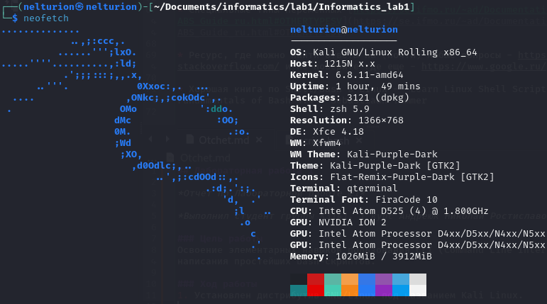

## Лабораторная работа 1

*Отчет по Лабораторной работе №1*

*Выполнил студент группы K3141, 1 курс Андреюк Николай Ростиславович. Номер ИСУ 475074*

### Цель работы
Освоение элементарных навыков пользования CLI (Command Line Interface) и написания простейших bash-скриптов.

### Ход работы
1. Установлен дистрибутив GNU/Linux под названием Kali Linux.

2. С помощью CLI создан файл исполняемого сценария [script.bash](./script.bash)

3. Выполнена задача по написанию bash-скрипта, который принимает параметр произвольной длины, введеный через пробелы, и выводит текст этого параметра

### Вывод
В процессе выполнения лабораторной работы я научился:
1. Устанавливать дистрибутивы GNU/Linux;
2. Пользоваться терминалом для работы с файловой системой и системой контроля версий git;
3. Писать Bash-скрипты.

### Использованая литература:
1) Bash-скрипты / Хабр. https://habr.com/ru/companies/ruvds/articles/325522/
